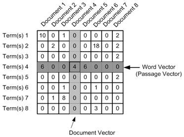

# Complaint Status Tracking

###  Install

This project requires **Python** and the following Python libraries installed:

- [NumPy](http://www.numpy.org/)
- [Pandas](http://pandas.pydata.org/)
- [scikit-learn](http://scikit-learn.org/stable/)
- nltk
- stemming

###Problem Statement

A financial institution news agency has collected 3000 news articles that relates to several matters of financial importance. Before analyzing these unlabeled news, it is only fair to try to partition them into some sort of logical groupings based on their similarities.

Your task is to use appropriate unsupervised machine learning algorithm to form the news clusters based on their similarity. Prior to clustering it is recommended to perform basic natural language processing steps such as stemming, tokenization and word vectorization for best results.

Notes to keep in mind:

1. There are no duplicate rows in the dataset.
2. Cluster number should start from 0.

### Data Description

There is only one file news.csv that contains date, headlines and text of the news.

| **Column**   | **Description**                  |
| ------------ | -------------------------------- |
| **id**       | The unique id of the news        |
| **headline** | The headline of the news in text |
| **text**     | The body of the news in text     |

[**Download** ](https://he-s3.s3.amazonaws.com/media/hackathon/brainwaves-machine-learning/clustering-financial-news/9379d3dc-0-dataset.tar.gz)

### Code

The code is provided in the  `Clustering.ipynb` file. The `dataset` directory needs to be present in the same directory having `news.csv` file.

### Run

In a terminal or command window, navigate to the top-level project directory having `Clustering.ipynb ` and then run one of the following commands:

`ipython notebook Clustering.ipynb`

or

`jupyter notebook Clustering.ipynb`

This will open the Jupyter Notebook software and project file in your browser.

### Methodology

#### Implementation

- The data is read into a pandas dataframe.

- `punkt` tokenizer is downloaded from `nltk`.

- NaN values are filled with `NULL`.

- `tokenize_and_stem` function

  - tokenize by sentence
  - toeknize by word
  - filter out tokens not contianing letters
  - apply `Snowball` stemmer to stem the filtered tokens

- Apply `TF-IDF` vectorizer  parameters and then convert the list into `TF-IDF` matrix. To get a Tf-idf matrix, first count word occurrences by document. This is transformed into a document-term matrix (dtm). This is also just called a term frequency matrix. An example of a dtm is here at right.

  

- Apply `K-means` clustering using the `tf-idf` matrix.

- Save the required files to the disk.

The source code is available on [Github](https://github.com/vikashvverma/ml-contests/tree/master/hackerearth/sg)